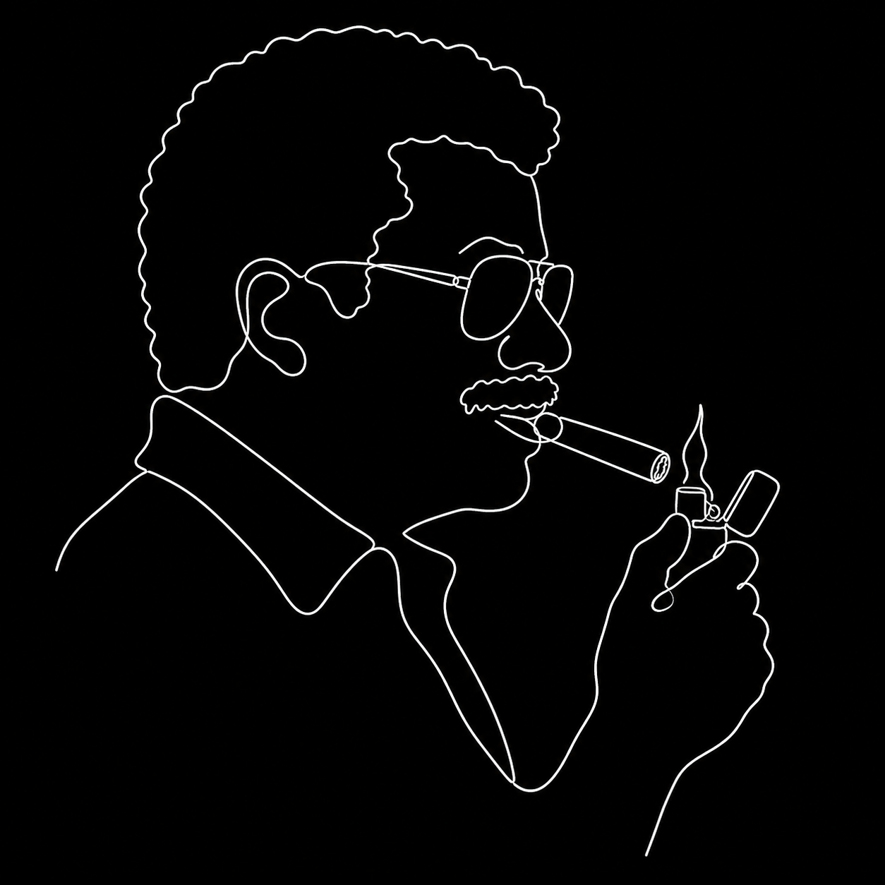

<p align="center">
  
</p>

<h1 align="center">neilization</h1>

<p align="center">
  <strong>turn plain explanation into cosmic-perspective public science</strong>
</p>

<p align="center">
  <a href="#before--after">Before/After</a> ·
  <a href="#real-transformations">Real Transformations</a> ·
  <a href="#install">Install</a> ·
  <a href="#what-you-get">What You Get</a> ·
  <a href="#how-it-works">How It Works</a> ·
  <a href="#quality-bar">Quality Bar</a>
</p>

---

`neilization` is a Claude skill for rewriting explanatory prose into a vivid cosmic-perspective popular-science register. It preserves the source meaning, cuts dead weight, defines what the reader needs, translates scale, and makes the argument move.

It is not a celebrity impersonation tool. It does not claim exact Neil deGrasse Tyson imitation. It uses high-level public-science techniques: concrete analogy, scale translation, evidence sorting, dry restraint, and the view from a wider frame.

## Before / After

<table>
<tr>
<td width="50%">

### Generic explainer

> Machine learning is a transformative technology that leverages data to identify patterns and make predictions across many industries.

</td>
<td width="50%">

### Neilized

> Machine learning begins with examples. Feed a model enough labeled X-rays, loan applications, or weather readings, and it adjusts its internal settings until its guesses stop being terrible. The machine has not acquired wisdom. It has fit a function to a mountain of cases. What changed in the past decade is the size of the mountain.

</td>
</tr>
<tr>
<td>

### Flat civic prose

> Public debates often become divided because people hold different beliefs and values. A more scientific mindset could help society become more rational.

</td>
<td>

### Neilized

> Most public arguments begin with people treating their beliefs as facts. Science asks for a colder sorting process. What was measured? What was inferred? What is merely preferred? Once those piles are separated, some disputes shrink. Others survive, but at least we know what we are actually arguing about.

</td>
</tr>
</table>

**Same claim. Better path. More concrete thought.**

```
┌───────────────────────────────────────┐
│  MEANING PRESERVED       ████████ yes │
│  EMPTY HYPE REMOVED      ████████ yes │
│  SCALE MADE VISIBLE      ████████ yes │
│  AUTHOR SAFETY BOUNDARY  ████████ yes │
└───────────────────────────────────────┘
```

## Real Transformations

These are literal input paragraphs transformed with this skill's own rules. They are not quotations, external examples, or claims of exact author imitation.

<table>
<tr>
<td width="50%">

### Source paragraph

> Cities install heat sensors to understand where neighborhoods become dangerously hot. The data can help officials decide where to plant trees, open cooling centers, and update building rules.

</td>
<td width="50%">

### Neilized result

> On a summer afternoon, a city does not heat evenly. Asphalt lots, flat roofs, and treeless blocks hold heat long after the weather report gives one tidy number for the whole place. A heat sensor turns that hidden geography into evidence. Once officials can see which blocks are storing the most heat, shade stops being decoration. It becomes infrastructure, as practical as a drain or a streetlight.

</td>
</tr>
<tr>
<td>

### Source paragraph

> Teachers use formative assessment to see what students understand during a lesson. This information helps them adjust instruction before the final test.

</td>
<td>

### Neilized result

> By the time a final exam arrives, the learning has already happened or failed to happen. Formative assessment moves the measurement upstream. A quick question, a messy worksheet, or a wrong answer on the board tells the teacher where the class is losing the thread while there is still time to repair it. It is less like a verdict and more like an instrument panel for the lesson while the lesson is still flying.

</td>
</tr>
<tr>
<td>

### Source paragraph

> Space exploration can inspire students and lead to technological innovation, but public investments must be balanced against other needs.

</td>
<td>

### Neilized result

> A space program is never paid for with awe. It is paid for with budgets, which means it must stand beside schools, bridges, hospitals, and every other claim a civilization makes on its future. Its strongest case is not simply that the universe is beautiful, though it is. The case is that exploration trains a society to solve problems at the edge of what it knows, then returns some of that discipline to Earth in the form of instruments, engineers, and ambition.

</td>
</tr>
</table>

## Install

Put the folder here:

```bash
~/.claude/skills/neilization/
```

Expected local layout:

```text
neilization/
├── SKILL.md
├── README.md
├── assets/
│   └── neilization.png
├── references/
│   ├── examples.md
│   ├── formulaic-vocabulary.md
│   ├── safety-and-integrity.md
│   ├── structural-patterns.md
│   └── voice-patterns.md
└── scripts/
    └── validate.mjs
```

Trigger it by asking Claude to:

```text
/neilization this paragraph
neilize this essay
make this more cosmic
rewrite this for the public
give this a popular science voice
```

## What You Get

| Capability | What it does |
|---|---|
| Meaning-first rewrite | Preserves the source's base claim while improving structure and clarity. |
| Editorial pruning | Deletes repetition, throat-clearing, ornament, and sections that do not contribute. |
| Supported expansion | Adds definitions, causal bridges, scale analogies, limits, and consequences when the source supports them. |
| Four registers | Popular science, civic cosmic perspective, formal research clarity, and interview or speech clarity. |
| Structural repair | Reorders paragraphs around chronology, cause, evidence strength, scale, or argument pressure. |
| Formulaic prose cleanup | Replaces inflated vocabulary, stock transitions, and empty wonder with concrete language. |
| Safety boundary | Avoids exact living-author imitation, copied phrasing, fabricated evidence, and detector-evasion framing. |

## How It Works

1. Claude reads `SKILL.md` when the request matches the trigger.
2. The skill chooses a mode based on the source: explainer, civic, research, or speech.
3. For substantial rewrites, Claude reads `references/voice-patterns.md`.
4. If the draft feels generic, Claude checks `structural-patterns.md` and `formulaic-vocabulary.md`.
5. If the user mentions detectors or disclosure, Claude reads `safety-and-integrity.md`.
6. Claude returns the final rewrite by default, with an audit only when asked.

The skill is deliberately split. `SKILL.md` stays short so Claude can act quickly. References stay one level deep so the agent can load detail only when the task needs it.

## Modes

| Mode | Use when | Shape |
|---|---|---|
| Popular science explainer | Science, technology, AI, astronomy, engineering, statistics, education | Familiar handle, mechanism, scale translation, observable consequence, humble close. |
| Civic cosmic perspective | Culture, policy, ethics, identity, risk, truth, civilization | Human disagreement, wider vantage point, category check, concrete contradiction, human consequence. |
| Formal research clarity | Papers, reports, grants, institutional prose, academic work | Claim, method or evidence, limit, consequence. |
| Interview or speech clarity | Q&A, talks, testimony, transcripts | Direct answer, concrete example, mechanism, wider consequence. |

## Example Prompts

```text
Neilize this abstract for a general audience.
```

```text
Rewrite this policy paragraph with a cosmic-perspective frame, but keep the claim sober.
```

```text
Make this AI explanation vivid for nontechnical readers. Preserve the meaning and add scale analogies only where supported.
```

```text
Edit this speech answer so it sounds direct, concrete, and public-facing.
```

```text
Turn this draft into a popular-science introduction. Cut any section that is not doing work.
```

## Quality Bar

A strong neilized rewrite should pass these checks:

| Check | Standard |
|---|---|
| Base meaning | The original claim still survives. |
| Evidence | Added detail is supported or safe general explanation. |
| Scale | Big and tiny quantities are translated into something a reader can picture. |
| Mechanism | Wonder comes from what the thing does, not from hype words. |
| Structure | Each paragraph adds a fact, mechanism, contrast, consequence, or scale shift. |
| Register | Formal texts stay formal; public-facing texts get more vivid. |
| Safety | No exact living-author claim, copied distinctive phrasing, fake evidence, or detector promises. |

## Safety Boundary

`neilization` will not:

- Claim to reproduce a living author's prose exactly.
- Copy distinctive sentences from books, essays, interviews, or papers.
- Invent sources, data, dates, page numbers, quotes, memories, or anecdotes.
- Promise detector results.
- Add fake mistakes, hidden characters, disclosure-avoidance tactics, or artificial quirks.

If a user asks for those, the skill redirects to transparent editing: clearer claims, stronger structure, accurate evidence, and prose the writer can defend.

## Validate

Run:

```bash
node ~/.claude/skills/neilization/scripts/validate.mjs
```

The validator checks frontmatter, required files, the image asset, README links, unsafe wording, and the no-emoji README rule.

## File Map

| File | Purpose |
|---|---|
| `SKILL.md` | Runtime instructions Claude loads when the skill triggers. |
| `README.md` | Human-facing overview, examples, usage, and quality bar. |
| `assets/neilization.png` | Visual mark used by the README. |
| `references/voice-patterns.md` | Detailed public-science rewrite patterns. |
| `references/structural-patterns.md` | Paragraph and argument-shape repairs. |
| `references/formulaic-vocabulary.md` | Inflated words, empty transitions, and plain replacements. |
| `references/safety-and-integrity.md` | Detector, disclosure, and exact-imitation boundary. |
| `references/examples.md` | Constructed examples for quick calibration. |
| `scripts/validate.mjs` | Repeatable package validation. |

## Design Notes

The skill follows the same packaging discipline that makes Caveman easy to trust:

- Strong symbol.
- Short promise.
- Before/after proof.
- Clear install path.
- Small runtime file.
- One-level references.
- Explicit safety boundary.
- Repeatable validation.

Same universe. Better sentence.
